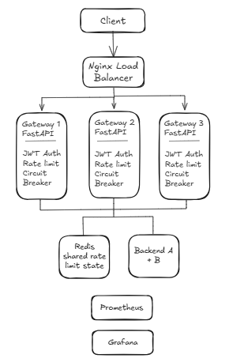

# Mini API Gateway

A distributed API gateway built with FastAPI, Redis, Nginx, JWT authentication, rate limiting, circuit breaking, and Prometheus/Grafana monitoring.

The project was built to understand how API gateways such as Kong and Envoy handle authentication, traffic control, fault tolerance, and observability.

## Architecture



### Request Flow

Client → Nginx → Gateway instances → Backend services

Redis provides shared rate-limit state across gateway instances, while Prometheus collects metrics and Grafana visualizes them.

## Features

- JWT-based authentication at the gateway
- Fixed-window rate limiting
- Token-bucket rate limiting
- Redis-backed distributed rate limiting
- Nginx load balancing across multiple gateway instances
- Circuit breaker for backend services
- Prometheus metrics
- Grafana monitoring dashboard
- Locust-based load testing
- Automated rate-limiter test

## Running the Project

Start the gateway with three instances:

```bash
docker compose up --build --scale gateway=3
```
## Load Test Results
### 1. Fixed Window
- Requests: 12,428
- Failed/blocked requests: 12,248
- Throughput: 52.8 req/sec
- p95 latency: 570 ms
The high number of blocked requests is expected because this test intentionally generates traffic beyond the configured rate limit.
### 2. Multi-Instance Gateway
- Requests: 7,655
- Failed/blocked requests: 7,545
- Throughput: 142.9 req/sec
- p95 latency: 130 ms
The gateway was scaled to three instances behind Nginx. Redis maintained shared rate-limit state across the gateway instances.
### 3. Token Bucket
- Requests: 17,791
- Failed/blocked requests: 17,216
- Throughput: 110.6 req/sec
- p95 latency: 440 ms
This test evaluates the token-bucket rate-limiting algorithm.
### 4. Normal Multi-User Traffic 
- Virtual users: 50
- Requests: 1,121
- Throughput: ~10 req/sec
- Median latency: ~3.5 sec
- p95 latency: ~5.3 sec
- p99 latency: ~6.0 sec
- Average latency: ~3.6 sec
- Unexpected failures: 11 (~1%)
This test used randomized users selected from a pool of 200 fake users to simulate more realistic traffic.
Full screenshots are available in the results/ directory.
Design Decisions
Redis for Rate Limiting
Redis was used instead of in-process memory so that rate-limit state is shared between multiple gateway instances.
Centralized Authentication
Authentication is performed at the gateway so backend services do not need to handle client credentials directly.
Nginx Load Balancing
Nginx distributes incoming requests across multiple gateway instances, allowing the system to demonstrate horizontal scaling.
Async Redis
Redis operations use the asynchronous Redis client so that Redis calls do not block the FastAPI event loop.
Circuit Breaker
The circuit breaker follows:
Closed → Open → Half-Open → Closed
with automatic recovery after the configured timeout.
Testing
A basic automated test verifies the Redis-backed fixed-window rate limiter:
- Requests within the limit are allowed.
- The 11th request is blocked after 10 allowed requests.
Run the test inside the gateway container:
docker compose exec gateway python -m pytest test_rate_limiter.py

## Technology Stack
- Python
- FastAPI
- Redis
- Nginx
- Docker / Docker Compose
- Prometheus
- Grafana
- Locust
- JWT
